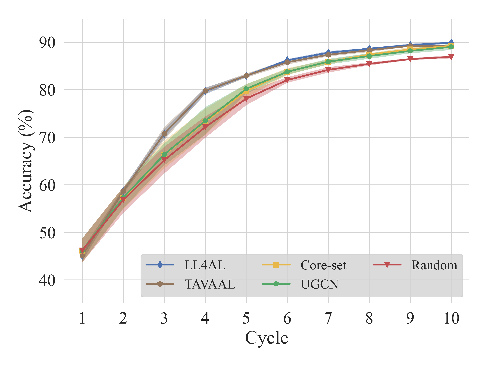
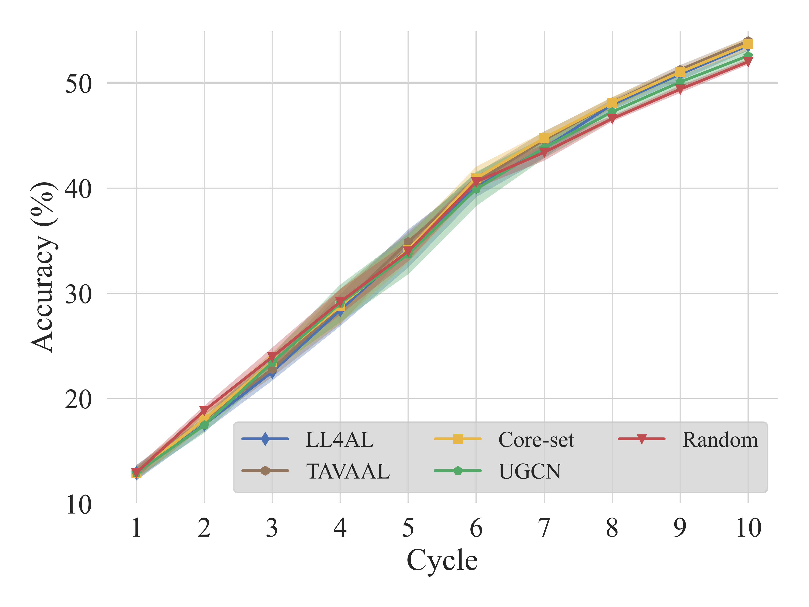
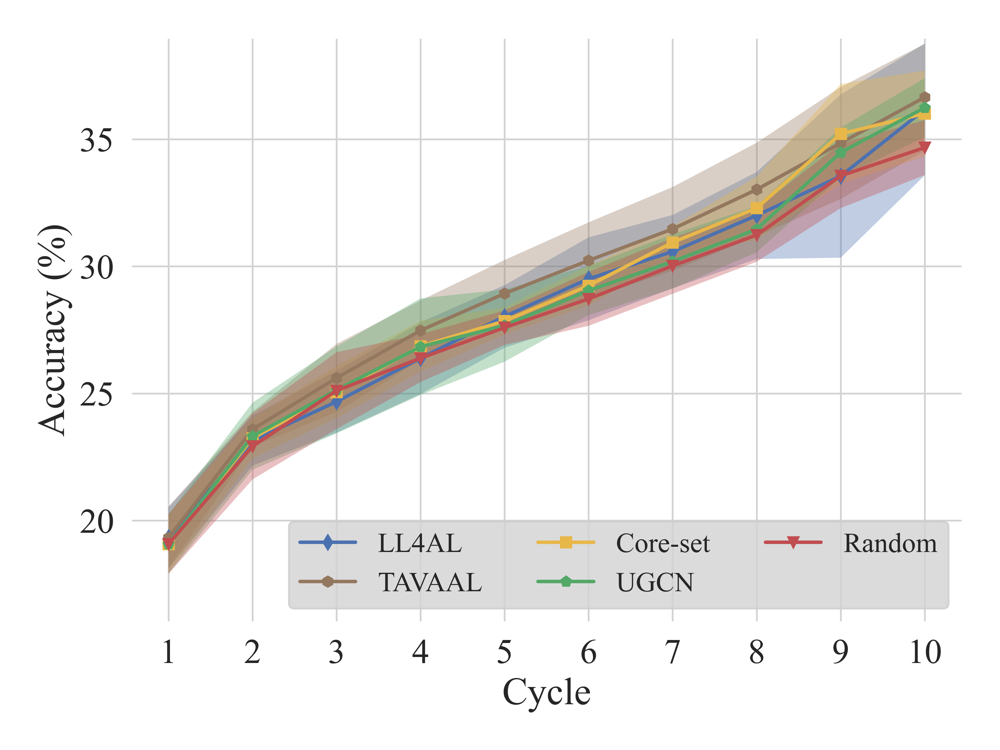

# 24-1 사회문제해결을위한ICT드론기술 Project

## 💁‍♀️ About Project
- 👩‍💻 Owner: 홍주영 (22110348)
- 📜 Major : 지능기전공학전공
- 🍀 Project (Algorithm) : Active Learning 
   - Random 
   - UGCN: [[CVPR 2021] Sequential graph convolutional network for active learning](https://openaccess.thecvf.com/content/CVPR2021/papers/Caramalau_Sequential_Graph_Convolutional_Network_for_Active_Learning_CVPR_2021_paper.pdf)
   - CoreSet: [[ICLR 2018] Active learning for convolutional neural networks: A core-set approach](https://openreview.net/pdf?id=H1aIuk-RW)
   - LL4AL: [[CVPR 2019] Learning Loss for Active Learning](https://openaccess.thecvf.com/content_CVPR_2019/papers/Yoo_Learning_Loss_for_Active_Learning_CVPR_2019_paper.pdf)
   - TA-VAAL: [[CVPR 2021] Task-Aware Variational Adversarial Active Learning](https://openaccess.thecvf.com/content/CVPR2021/papers/Kim_Task-Aware_Variational_Adversarial_Active_Learning_CVPR_2021_paper.pdf)

## 💡 Experiment Result

### CIFAR10 (Benchmarks)
<p align="center"></p>

### CIFAR100 (Benchmarks)
<p align="center"></p>

### CIFAR10im (Benchmarks): CIFAR10-imbalanced
<p align="center"></p>


---

# 🎞 Data Preparation
## Getting the Dataset
* CIFAR10 and CIFAR100 are automatically downloaded when code is executed.
* ImageNet can be downloaded from https://www.image-net.org/
* The ImageNet data should be located like the structure below. 

~~~~
├── ImageNet
   └── train_task12
      ├── n01440764
      ├── n01443537
      └── ...
   └── validation
      ├── n01440764
      ├── n01443537
      └── ...
~~~~
    
# 🔨 Prerequisites

### Recommended Environment
* OS - Ubuntu 18.04
* CUDA - 11.7
* Python - 3.7.16
* Pytorch - 1.13.1
* GPU Hardward  - A6000
* Our packages are listed in **requirement.txt**. You can install by running:

```
pip install -r requirement.txt
```


# 🚀 Running

To run the training code for each dataset, use the following scripts:

```bash
# Run CIFAR-10 training
bash run_train_cifar10.sh
# Run CIFAR-100 training
bash run_train_cifar100.sh
# Run imbalanced CIFAR-10 training
bash run_train_imbalance_cifar10.sh

```

Each script file performs training for the respective dataset. Additionally, you can modify the APP option in the run_train_{dataset name}.sh file to choose a different methodology. Here is a list of available methodologies:

|Notation in Figure|Paper|{APP}|
|------|---|---|
|Random|-|Random|
|UGCN|Sequential graph convolutional network for active learning|UncertainGCN|
|Core-set|Active learning for convolutional neural networks: A core-set approach|CoreSet|
|LL4AL|Learning Loss for Active Learning|LL4AL|
|TAVAAL|Task-Aware Variational Adversarial Active Learning|TA-VAAL|
